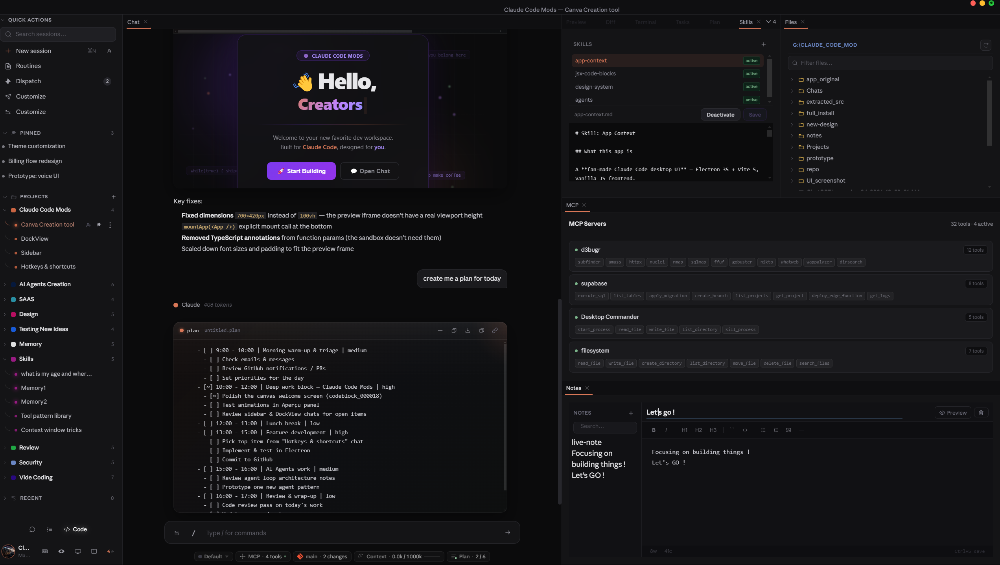

# Claude Code Mods

> A fan-made Electron desktop UI for the [Claude Code CLI](https://github.com/anthropics/claude-code) — built to make agentic coding sessions more transparent, safer, and easier to manage.

**Not affiliated with Anthropic. Built by a developer who uses Claude Code every day.**

[](https://github.com/hlsitechio/Claude-Code-Mods)
[](LICENSE)
[](https://electronjs.org)
[](https://github.com/anthropics/claude-code)

---



---

## What this is

The Claude Code CLI is powerful but terminal-only. This project wraps it in a native desktop UI built around one idea: **everything Claude does should be visible, organized, and in reach.**

---

## Key features

### 🪟 Dockview workspace
A full drag-and-drop panel canvas. Every tool lives in its own resizable, re-dockable panel tab — open as many as you need side by side. Right-click anywhere to add panels from the context menu.

| Panel | What it does |
|-------|-------------|
| **Chat** | Main conversation + streaming indicators |
| **Preview** | Live JSX/HTML/React iframe with zoom controls (−/+/reset) |
| **Terminal** | Embedded shell (PowerShell / bash) |
| **Files** | Full project file tree |
| **Skills** | Browse, edit, activate/deactivate skill files — with inline editor |
| **Notes** | Persistent markdown scratchpad with toolbar + live preview |
| **Plan** | Claude's task plan rendered as a kanban-style checklist |
| **MCP** | All connected MCP servers and their tools at a glance |
| **Git** | Branch / status / diff view |
| **Context** | Context window usage breakdown |
| **Shortcuts** | Keyboard shortcut reference |

### ✨ Skills manager
Skill files (`@skills/filename.md`) are injected into sessions on demand. The Skills panel shows every skill with an **active** badge for files currently imported in `CLAUDE.md` — one click to activate or deactivate, inline editor to modify.

### 🧠 Workspace awareness
A `workspace-index.json` is written to disk on every state change. Claude reads it via file tools, so it always knows your project names, session history, model, and permission mode. A hidden system prompt layer injects the full context on every CLI turn.

### 🔐 Permission modes — visible by default
Four modes mapped directly to CLI flags, always one click away and color-coded:

| Mode | CLI flag | When to use |
|------|----------|-------------|
| **Default** | *(none)* | Interactive — Claude asks before acting |
| **Plan** | `--plan` | Review the plan before any execution |
| **Accept** | `--auto-approve-everything` | Trusted scripted workflows |
| **Bypass** | `--dangerously-skip-permissions` | Fully autonomous runs |

### 📁 Project organizer
- Drag-to-reorder projects in the sidebar
- Per-project color accents that cascade through the UI
- Drag sessions between projects
- Fork, rename, pin, delete via context menu

### 🎨 Chat UI
- 9 streaming state variants with gradient shimmer: `thinking` · `generating` · `coding` · `tools` · `searching` · `reading` · `running` · `applying` · `writing`
- Code blocks: syntax highlighting, line numbers, copy, download, inline JSX preview, open in panel
- Code block scroll capped at 380px with Show more / Show less toggle

### 🖥️ JSX live preview
Claude writes a React component → click 👁 → it renders inline. No build step.
- Babel standalone compiles JSX synchronously
- `<script type="importmap">` resolves `react`, `react-dom/client`, `framer-motion` to esm.sh
- Preview panel with zoom in/out/reset controls

### 📊 Live context panel
Real data from the CLI `result` event — not estimates:
- Input / output / cache tokens, cost in USD, tool call count
- Arc gauge showing % of context window used

---

## Architecture

```
┌─────────────────────────────────────────┐
│  Electron renderer (app.js + style.css) │  ← All UI, state, rendering
│  workspace.js  (dockview panels)        │
│                                         │
│  Hidden system layer (every turn):      │
│    CHAT_SYSTEM_PROMPT                   │
│  + buildSessionContext()                │  ← Projects, sessions, model, mode
│  + workspace-index.json (on disk)       │
└─────────────┬───────────────────────────┘
              │ IPC (ipcRenderer.invoke)
┌─────────────▼───────────────────────────┐
│  Electron main (main.js)                │
│    fs / shell / kb / memory / agents    │
│    claude:send → streamMessage()        │
└─────────────┬───────────────────────────┘
              │ child_process.spawn
┌─────────────▼───────────────────────────┐
│  claude-service.js                      │
│    Spawns: claude --output-format stream│
│    Parses NDJSON events                 │
│    Emits: claude:chunk / claude:done    │
└─────────────┬───────────────────────────┘
              │ JSON stream
┌─────────────▼───────────────────────────┐
│  Claude Code CLI (official)             │
│  github.com/anthropics/claude-code      │
└─────────────────────────────────────────┘
```

---

## Getting started

### Prerequisites
- [Node.js](https://nodejs.org) 18+
- [Claude Code CLI](https://github.com/anthropics/claude-code) installed and authenticated (`claude` in PATH)

### Install & run

```bash
git clone https://github.com/hlsitechio/Claude-Code-Mods.git
cd Claude-Code-Mods
npm install

# Development (hot-reload)
npm run electron:dev

# Build Windows installer
npm run dist
```

---

## Stack

| Layer | Tech |
|-------|------|
| Desktop | Electron 35 |
| Panels | dockview-core |
| UI | Vanilla JS (ES modules), no framework |
| Styles | Plain CSS with custom properties |
| Icons | Phosphor Icons |
| Build | Vite 5 |
| Packaging | electron-builder (NSIS installer + portable) |
| JSX preview | Babel standalone + importmap + esm.sh |

---

## Contributing

PRs welcome. A few guidelines:

- Keep `app.js` and `style.css` as the single source of truth — no framework, no build pipeline for the renderer
- Any new IPC channel needs a handler in `main.js` and an entry in `preload.js`
- New skills go in `skills/` as plain markdown — they're loaded by the CLI automatically via `CLAUDE.md`

---

## Acknowledgements

Built on top of [Claude Code](https://github.com/anthropics/claude-code) by Anthropic. This project exists because the CLI is excellent — the goal is to make it accessible to more people, not to improve it.

---

## License

MIT — use it, fork it, build on it.
